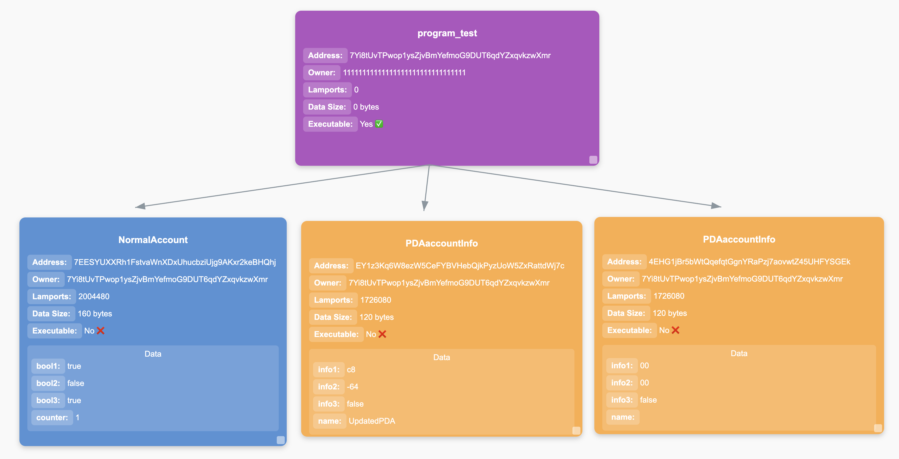

# Solana Program Account Scanner

## Overview
This script scans and extracts account information for Solana programs based on their Interface Definition Language (IDL) files. It uses the `@coral-xyz/anchor` and `@solana/web3.js` libraries to interact with the Solana blockchain, identify different types of accounts, and decode account data.

## Features
- Loads IDL files from `target/idl/`.
- Scans all accounts associated with detected programs.
- Identifies account types: Wallets, PDAs, Data Accounts, and Programs.
- Decodes account data using the `BorshAccountsCoder`.
- Saves all extracted information to `accounts.json`.
- Display it



## Prerequisites
Ensure you have the following installed:
- **Node.js** (>=16.x recommended)
- **Anchor** framework (for building Solana programs)
- **Solana CLI** (for interacting with the blockchain)

## Installation
```sh
npm install https://github.com/crytic/anchorx-ray
```

## Configuration
If your test don't use the same rpc url, you can change in the .env file:
```
RPC_URL=<YOUR_RPC>
```
If no RPC URL is provided, the script defaults to `http://127.0.0.1:8899` (local Solana test validator).

## Usage
Run the script in your Anchor project:
```sh
npx anchorx-ray
```

This will:
1. Load all IDL files from `target/idl/`.
2. Fetch programs owned by the accounts from the RPC.
3. Identify and categorize these accounts using IDL and some other computations.
4. Save the results in `accounts.json`.
5. Open a visualization at http://localhost:3000/ in the browser.

## Account Type Identification
The script categorizes accounts as:
- **Program Account**: The executable program itself.
- **Wallet**: A system account owned by the Solana System Program. (normally it will not happen for the moment since only accounts owned by the program are taken from the RPC)
- **PDA (Program Derived Address)**: A non-executable program-owned address.
- **Data Account**: A regular program-owned account storing data.
- **Other**: Any account that doesn’t fit the above categories.

## Output Format
The output is saved in `accounts.json` and contains details like:
```json
[
  {
    "name": "example_program",
    "address": "ABC123...",
    "owner": "11111111111111111111111111111111",
    "lamports": 1000000,
    "executable": true,
    "dataSize": 0,
    "accountType": "Program",
    "decodedData": null
  }
]
```

And it will open a diagram showing all accounts used in the tests (program + accounts owned by the program)

## Troubleshooting
- **No IDL files found**: Ensure you have built your Anchor program using `anchor build`.
- **Failed to fetch accounts**: Check your RPC URL and network connection.
- **Only one program is shown in the diagram**: Ensure you have run tests.

## For developers
If you want to update a part of the script, 
1. Clone the repo
```sh
gh repo clone crytic/anchorx-ray
```
2. Install dependencies
```sh
npm install
```
3. Do your modifications
4. Then
```sh
npm run build
```
