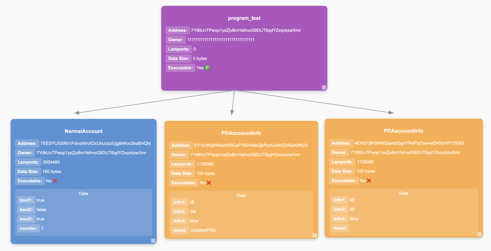

# Example

To run anchorx-ray on the example, you need to run the project's tests. To do that, open two terminals.

On the first terminal, run
```bash
solana-test-validator
```

On the second terminal, run
```bash
npm install
anchor keys sync && anchor clean
anchor test --skip-local-validator
npx anchorx-ray
```

`anchorx-ray` will then open a local web page:


